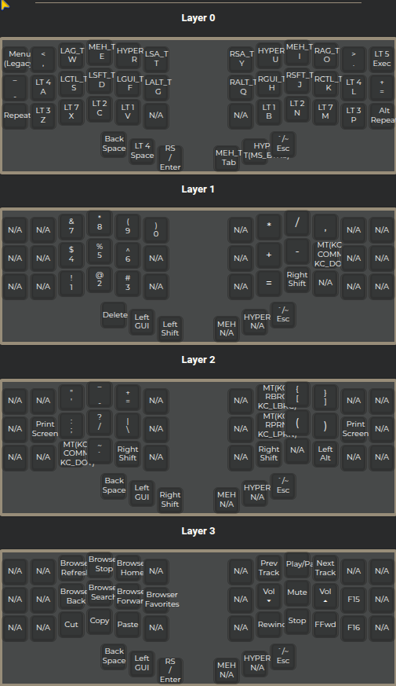
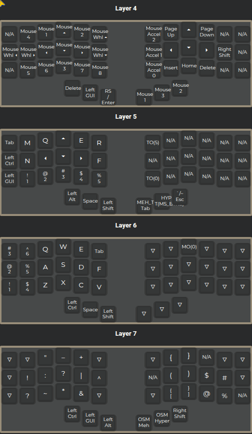
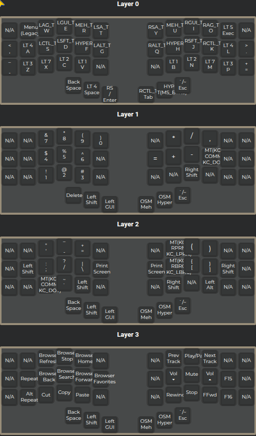
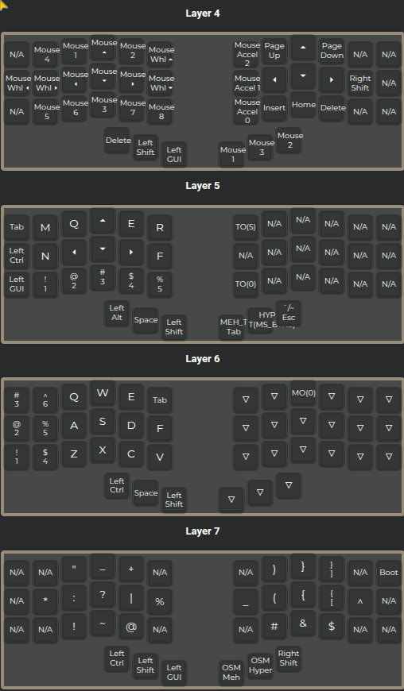
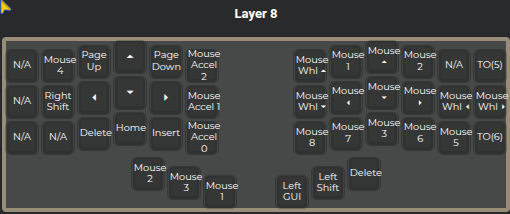

# qmk-piantor-pro

A customized QMK layout for the **Beekeeb Piantor Pro** — designed for comfort, symmetry, and efficient daily use.

---

## ⚙️ Features

- Split, **ergonomic** layout  
- **Symmetric** layer philosophy (mirrored logic left/right)  
- Full **QMK support**: tap-dance, mod-tap, combos  
- Optimized for **minimal hand travel** and **maximum comfort**  
- Custom **thumb cluster logic**  
- Revised **layer organization and sorting method** for cleaner structure

---

## 🗺️ Layout Overview

| Layer | Purpose |
|--------|--------|
| Base  | Primary typing layer (letters + essential symbols) |
| Nav   | Movement, navigation, and shortcuts |
| Media | Volume, playback, and system controls |
| Num   | Number pad + symbol utilities |
| Game  | Reserved (planned Layer 5) |
| Mouse | Cursor control and mouse actions |

Built using:  
<https://config.qmk.fm/#/beekeeb/piantor_pro/LAYOUT_split_3x6_3>

# main

  

# main alt 0

  

---

## 🧩 Notes

- Introduces a new approach to **keymap sorting and organization**  
- Refines **thumb cluster roles**  
- Designed around **flow, predictability, and mirroring**

---

## 🎯 Goals

### Short Term

- ✅ Finalize base, navigation, and media layers
- ✅ Improve tap / hold consistency  
- ⏳ Implement and refine **Layer 5 (Game layer)**  

### Long Term

- ⏳ Modular layer system (dynamic layout switching)  
- ⏳ Auto-shift + enhanced combos for faster input  
- ⏳ Clearer layer naming conventions  
- ⏳ Full documentation for contributors / forks  

---
