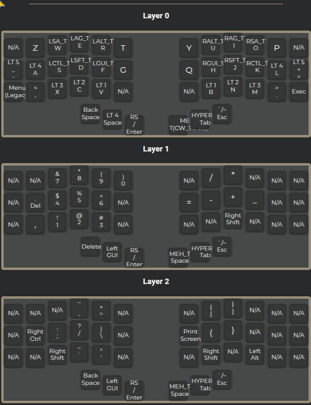
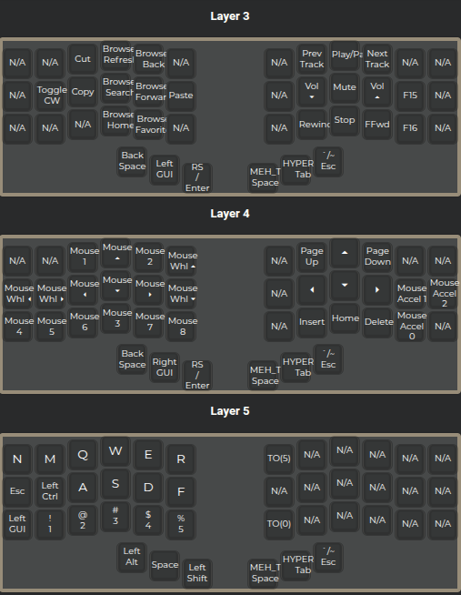

# qmk-piantor-pro

## ⚙️ Features

- Split **ergonomic** layout  
- **Symmetric** layer structure (mirrored logic left/right)  
- Full **QMK feature support**: tap dance, mod-tap, combos  
- Optimized for **minimal hand travel** and **maximum comfort**  
- Includes **custom thumb cluster logic**  
- Uses new **map sorting method** for cleaner layer organization

---

## 🗺️ Layout

| Layer | Purpose |
|-------|----------|
| Base  | Letters, symbols |
| Nav   | Directional, shortcuts |
| Media | Volume, playback, system |
| Num   | Numbers and symbols |
| Game  | TBD (planned for Layer 5) |
| Mouse | Cursor and click control |

made with <https://config.qmk.fm/#/beekeeb/piantor_pro/LAYOUT_split_3x6_3>




---

## 🧩 Notes

- New approach to **sorting keymaps**  
- Refined **thumb cluster** mapping  
- Layer logic designed for **flow and mirroring**

---

## 🎯 Goals

**Short term**

- ✅ Polish and finalize base, nav, and media layers  
- ✅ Improve tap/hold behavior consistency  
- 🔲 Implement and test **Layer 5 (Game layer)**  

**Long term**

- 🔲 Create **modular layer system** (dynamic layout switching)
- 🔲 Add **auto-shift** and **combos** for faster input  
- 🔲 Refine **layer naming** for clarity  
- 🔲 Document workflow for **future builds or forks**

---

## 🧰 Build & Flash

```bash
qmk compile -kb beekeeb/piantor_pro -km totem
qmk flash -kb beekeeb/piantor_pro -km totem
