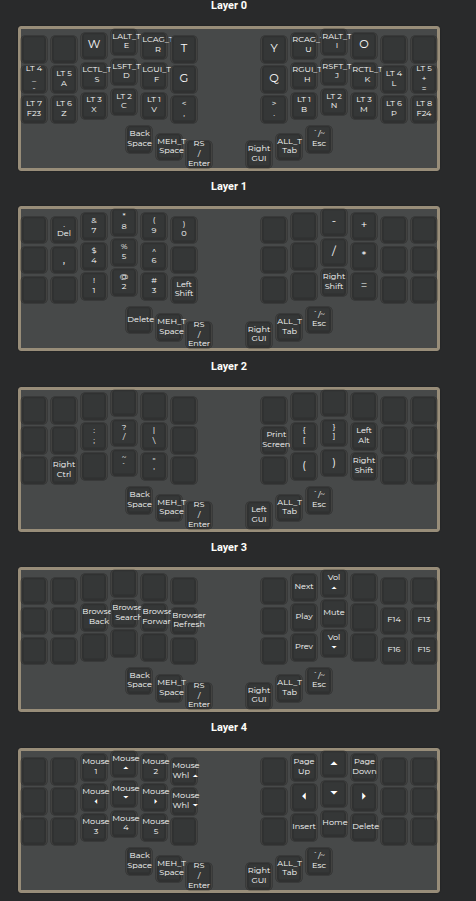

# qmk-piantor-pro

QMK Piantor Pro Totem Layout

Custom QMK firmware for the Piantor Pro keyboard with a unique totem-inspired layout.

About

This repository contains the custom QMK keymap and configuration files for the Piantor Pro, a low-profile split keyboard. The layout is inspired by symbolic balance and symmetry, reflecting the aesthetics of the included totem design.

Features

Split ergonomic layout

Custom symmetric layer design

Support for QMK features: tap dance, mod-tap, combos

Designed for minimal movement and maximum comfort

made with <https://config.qmk.fm/#/beekeeb/piantor_pro/LAYOUT_split_3x6_3>

