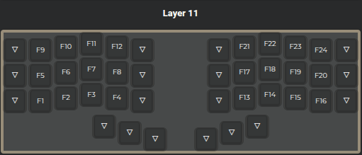

# qmk-piantor-pro

Customized QMK layout **Beekeeb Piantor Pro** — designed for comfort, symmetry, cozy and efficient daily use.

---

## ⚙️ Features

- Split ergonomic layout  
- Navigation and media control left/right sides mirror each other  
- Uses QMK features (mod-tap, tap-dance, combos)  
- Keeps finger movement low  
- Layers handled mostly by thumbs  
- Layers organized in a way that makes sense to me

---

## 🗺️ Layout Overview

| #  | Name              | Use |
|----|-------------------|-----|
| 0  | Base              | Letters |
| 1  | Num               | Numbers |
| 2  | Sym               | Symbols |
| 5  | Game              | Game |
| 6  | Game Num          | Game numbers |
| 9  | Media             | Media |
| 10 | Media (R)         | Media mirror |
| 11 | Function          | Function keys |
| 14 | Nav               | Navigation / browser |
| 15 | Nav (R)           | Navigation mirror |

Built with the [QMK Configurator](https://config.qmk.fm/#/beekeeb/piantor_pro/LAYOUT_split_3x6_3).

---

## 📸 Keymap Previews

### Main Alt 1 (Current)

### Main

  

### Main Alt 0

  
  

---

## 🧩 Notes

- Reworked how layers are organized so they’re easier to follow  
- Adjusted thumb keys to handle most layer switching  
- Everything is built around consistency and mirroring  

---

## 🎯 Goals

### Short Term

- Base, nav, and media layers are done  
- Still tuning tap/hold behavior  

### Long Term

- Improve combos and possibly add auto-shift  
- Clean up layer naming  
- Document things properly if I ever share this